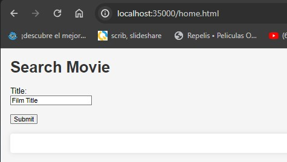

# Lab4 ARQUITECTURAS DE SERVIDORES DE APLICACIONES, META PROTOCOLOS DE OBJETOS, PATRÓN IOC
Este proyecto consiste en la creación de un servidor web tipo Apache en Java, capaz de entregar páginas HTML e imágenes tipo PNG. El servidor proporciona un framework de inversión de control (IoC) para construir aplicaciones web a partir de Plain Old Java Objects (POJOs). Se ha desarrollado un prototipo mínimo que demuestra capacidades reflexivas de JAVA y permite cargar un POJO y derivar una aplicación web a partir de él.

# Instalación 
## Herramientas 
- [MAVEN](https://maven.apache.org) : Para el manejo de las dependecias. 
- [GIT](https://git-scm.com) : Para el manejo de las versiones.
- [JAVA](https://www.java.com/es/) : Lenguaje de programación manejado.

  # Empezando
El proyecto incluye una clase encargada de gestionar solicitudes HTTP y enviar las respuestas correspondientes, junto con un mapa de rutas HTTP y sus respectivos manipuladores.

La clase "myWebService" define estas rutas HTTP y sus manipuladores asociados. Sirve como un ejemplo práctico que muestra cómo utilizar la clase "HttpServer" para establecer rutas HTTP personalizadas.


+ Para poder correr el laboratorio se clona el repositorio en una máquina local con el siguiente comando
  
    ```
  git clonegithub.com/XxELIngexX/Lab4.git
    ```

    liego escriba este comando para limpiar el proyecto Maven y compilarlo, si lo hace desde consola cdm es importante que este ubicado en el directorio lab4, o puede ejecutarlo desde el terminal en el IDLE

```bash
mvn clean install
```


+ este comando compilara todo el proyecto

### listo para ejecutar
ya esta todo listo, para poder ejecutar el proyecto ingrese por consola el siguiente comando:

```bash
java -cp "target/classes" edu.escuelaing.arem.ASE.app.myWebServices 

```
es importante que se encuentre en el directorio del proyecto, ya sea en la terminal CMD o en la terminal del IDLE

## DESCRIPCION DEL PROYECTO

Vamos a acceder a través de un navegador web a nuestro servidor creado para observar los recursos por defecto disponibles en el disco.

```
http://localhost:35000/home.html
http://localhost:35000/style.css
http://localhost:35000/script.js
```

+ cargamos un html con "http://localhost:35000/home.html"


+ cargamos un css con "http://localhost:35000/style.html"


+ cargamos un js con "http://localhost:35000/script.html"


Para visualizar el servicio de ejemplo que un usuario podría crear, podemos acceder a través de la ruta http://localhost:35000/action/, seguida del archivo que deseamos consultar o la ruta especificada por el usuario. Estos son los servicios disponibles:

```
http://localhost:35000/home.html
http://localhost:35000/style.css
http://localhost:35000/script.js
```


+ cargamos un get con "http://localhost:35000/action/arep"


+ cargamos un get con "http://localhost:35000/action/arsw"


+ cargamos un get con "http://localhost:35000/action/name"


+ cargamos un post con "http://localhost:35000/action/submit"
  la solicitud post se le envia como parametro el nombre, en este caso valor = "null"


Cuando el usuario ha definido sus propias rutas mediante anotaciones, se puede acceder a ellas a través de la dirección http://localhost:35000/component/, seguida de la ruta específica creada por el usuario.

+ Saludo normal: http://localhost:35000/component/hello
+ Saludo con nombre: http://localhost:35000/component/helloname?val=cesar
+ Cuadrado de un número: http://localhost:35000/component/square?val=9


## DISEÑO

Este proyecto se basa en la clase HttpServer, que se importó del lab 3 y se amplía para servir como el servidor que procesa las solicitudes del usuario y habilita la construcción de aplicaciones a medida. En este marco, se incorporan capacidades para administrar rutas especiales que el usuario define junto con las acciones asociadas a ellas, mediante anotaciones.

Se establece un mapa que vincula las rutas (por ejemplo: /helloname) con las acciones que el usuario desea ejecutar. Estas acciones se presentan como métodos anotados con @Component, lo cual indica que esas clases responderán a las solicitudes, y con @GetMapping(ruta) para definir el método que acepta un único parámetro y devuelve un String, ya sea con o sin parámetros.


## DESARROLLADO CON

* [Java version 17](https://www.oracle.com/co/java/technologies/downloads/) - Lenguaje de programación usado.
* [Maven](https://maven.apache.org/download.cgi) - Gestor de dependencias del proyecto
* [Git](https://git-scm.com/downloads) - Gestion de versiones del proyecto

<!--
## Version

We use [SemVer](http://semver.org/) for versioning. For the versions available, see the [tags on this repository](https://github.com/your/project/tags). -->

## Autor

* **Cesar Amaya Gomez** - [XxELIngexX](https://github.com/XxELIngexX)

<!--
## License
This project is licensed under the MIT License - see the [LICENSE.md](LICENSE.md) file for details -->


